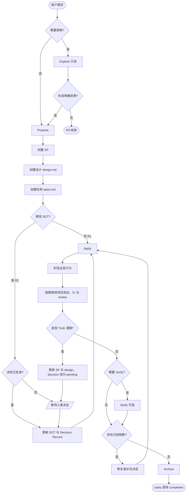

# P2T2C 核心工作流

P2T2C 表示 Proposal-to-Truth-to-Code。0.15 借鉴 OpenSpec 的动作式工作流，将默认路径缩减为：

```text
Explore 可选 -> Propose -> Apply -> Verify 可选 -> Archive
```

P2T2C 只治理需求提案、SOT、人类决策、已知阻断和文档安全。项目测试、CI 与 code review 继续由项目工程体系负责。



## 活动文档

```text
docs/proposals/SP-*.md
docs/specs/<NNN-change>/design.md
docs/specs/<NNN-change>/tasks.md
docs/sot/**
```

- R0 不创建文档。
- R1/R2 都创建 SP、design 和 tasks。
- SP 定义 why/what；design 定义 how；tasks 记录实施与完成。
- R2 在 Apply 前获得决定并更新 SOT。
- 完成后 specs 目录原地保留。

模板位于 `.p2t2c/templates/core/`。

## Archive

```bash
.p2t2c/bin/p2t2c archive --spec <NNN-change> --json
```

Archive 只检查 pending decision、未完成任务、已知失败、危险操作授权和 R2 Truth digest，然后原子地把 tasks status 标为 completed。它不运行测试、review、CI、release smoke，也不生成 CR、event、receipt 或 sidecar。

## 可选 Verify

Verify 检查 completeness、correctness 与 coherence。未运行不阻断；未解决 Critical 会写入 tasks Completion 并阻断 Archive。

## 冷归档与迁移

历史 ADR、CPK、CR/evidence 和旧 specs 位于 `docs/reference/archive/**`，不具有当前权威。已有项目使用显式迁移：

```bash
.p2t2c/bin/p2t2c docs-migrate --dry-run --decision-map FILE --json
.p2t2c/bin/p2t2c docs-migrate --apply --decision-map FILE --json
.p2t2c/bin/p2t2c docs-migrate --rollback .p2t2c/docs-migrate/ID/report.json --json
```

普通 upgrade 不搬迁项目文档。活动 0.14.x CPK/run 必须先按 legacy 流程收口。

## 来源

动作模型、design/tasks 分工与制品依赖思想参考 Fission-AI/OpenSpec；详见 `docs/reference/OPENSPEC_ATTRIBUTION.md`。
