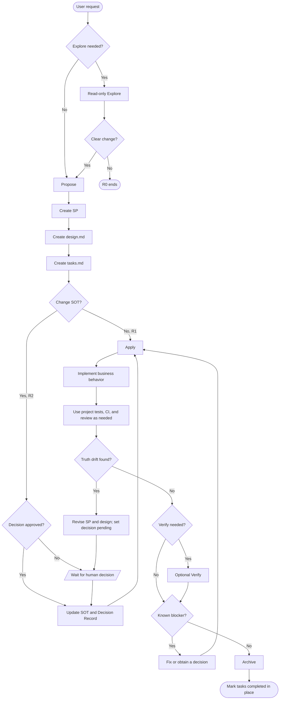

# P2T2C Core Workflow

P2T2C means Proposal-to-Truth-to-Code. Version 0.15 draws on OpenSpec's action-oriented workflow and reduces the default path to:

```text
Explore optional -> Propose -> Apply -> Verify optional -> Archive
```

P2T2C governs proposals, SOT, human decisions, known blockers, and document safety. Project tests, CI, and code review remain part of the project's engineering system.



## Active Documents

```text
docs/proposals/SP-*.md
docs/specs/<NNN-change>/design.md
docs/specs/<NNN-change>/tasks.md
docs/sot/**
```

- R0 creates no artifact.
- R1/R2 creates SP, design, and tasks.
- SP defines why/what; design defines how; tasks record implementation and completion.
- R2 receives a decision and updates SOT before Apply.
- Completed specs stay in place.

Templates live under `.p2t2c/templates/core/`.

## Archive

```bash
.p2t2c/bin/p2t2c archive --spec <NNN-change> --json
```

Archive checks only pending decisions, incomplete tasks, known failures, dangerous-operation authorization, and R2 Truth digest, then atomically marks tasks status completed. It runs no tests, review, CI, or release smoke and creates no CR, event, receipt, or sidecar.

## Optional Verify

Verify checks completeness, correctness, and coherence. Its absence does not block; an unresolved Critical is recorded in tasks Completion and blocks Archive.

## Cold Archive and Migration

Historical ADRs, CPKs, CR/evidence, and legacy specs live under `docs/reference/archive/**` and have no current authority. Existing projects use explicit migration:

```bash
.p2t2c/bin/p2t2c docs-migrate --dry-run --decision-map FILE --json
.p2t2c/bin/p2t2c docs-migrate --apply --decision-map FILE --json
.p2t2c/bin/p2t2c docs-migrate --rollback .p2t2c/docs-migrate/ID/report.json --json
```

Normal upgrade never migrates project documents. Active 0.14.x CPK/runs must close through the legacy workflow first.

## Attribution

The action model, design/tasks split, and artifact-dependency idea draw from Fission-AI/OpenSpec; see `docs/reference/OPENSPEC_ATTRIBUTION.md`.
