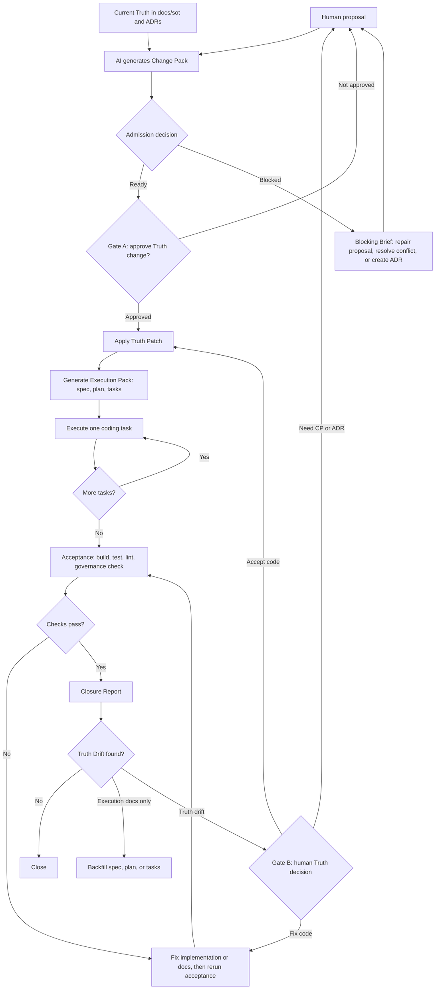

# P2T2C Release Selector

P2T2C means **Proposal-to-Truth-to-Code**.

## Overview

P2T2C is a workflow template for developers, product-minded engineers, technical leads, and AI-assisted software teams that want AI to help move implementation forward without quietly changing product rules, architecture decisions, or acceptance criteria.

Modern AI coding workflows often fail at the handoff between intent and implementation: a proposal becomes a plan, the plan becomes code, and the code later drifts away from the original business Truth. P2T2C makes that chain explicit. It separates proposals, authoritative Truth, execution documents, coding tasks, acceptance, and closure so every change has a traceable source and every drift has a defined human decision point.

The goal is to let AI stay productive while keeping humans in control of rule changes. Clear, non-conflicting proposals can move quickly through Change Pack, Gate A, Truth Patch, Execution Pack, task execution, and Closure Report. Ambiguous proposals, Truth conflicts, ADR needs, failed checks, or Truth Drift stop at explicit gates instead of being silently resolved by the AI.

Use P2T2C when you need:

- A repeatable AI collaboration workflow for real software projects.
- A source-of-truth structure that separates current rules from plans, prompts, tests, and implementation details.
- Human approval before business Truth, governance, or architectural decisions change.
- Install and upgrade scripts that can be copied into existing projects without overwriting project-owned files.
- Bilingual release roots for English and Chinese teams that need the same workflow in language-specific documentation.

## Workflow Diagram



This repository publishes the P2T2C workflow template as a bilingual MIT-licensed release selector. The repository root is only a selector and aggregate check surface; it is not a P2T2C release root.

## Release Roots

- `P2T2C_EN/`: English release root
- `P2T2C_CN/`: Chinese release root

Choose one release root before installing or upgrading:

```bash
cd P2T2C_EN
make check
make p2t2c-install-dry-run TARGET=/path/to/project
```

```bash
cd P2T2C_CN
make check
make p2t2c-install-dry-run TARGET=/path/to/project
```

## Repository Checks

Run both release checks and verify release-root checksums:

```bash
make check
make checksums
```

Run install and upgrade smoke tests for both release roots:

```bash
bash scripts/release_smoke_test.sh
```

GitHub Actions runs the same release checks and smoke tests through `.github/workflows/ci.yml`.

## License

P2T2C is released under the MIT License. See `LICENSE`.

Each standalone release root also includes `.p2t2c/P2T2C_LICENSE.md` so the license notice is preserved when installing only `P2T2C_EN/` or `P2T2C_CN/` into another project.
