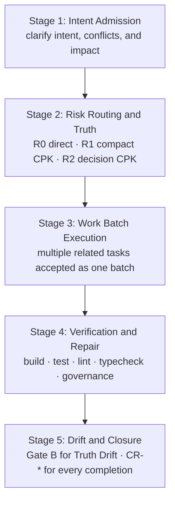

# P2T2C Release Selector

P2T2C means **Proposal-to-Truth-to-Code**. It is an AI-first engineering workflow that keeps business Truth explicit while routing work by risk instead of requiring the same documentation ceremony for every change.

## Workflow



Risk levels:

- `R0`: refactoring, tests, docs, CI changes, or restoring behavior already defined by Truth. No CPK or execution docs.
- `R1`: implement behavior already covered by Truth. Create a compact `CPK-*` and compact execution trio.
- `R2`: change Truth, ADRs, external contracts, persistent data semantics, security, privacy, permissions, or irreversible operations. Create a complete `CPK-*`.

Gate A controls only undecided R2 semantics. Gate B controls Truth Drift. Every completed R0/R1/R2 change creates a `CR-*` with actual verification evidence and remaining risks.

## Release Roots

- `P2T2C_EN/`: English release root
- `P2T2C_CN/`: Chinese release root

The repository root is only a selector and aggregate check surface. Current workflow Truth lives inside each selected release root under `docs/sot/**`.

## Checks

```bash
make check
make checksums
bash scripts/release_smoke_test.sh
```

`make check` validates both release roots and their stable path, manifest, version, and script parity.

## Install

Choose one release root:

```bash
cd P2T2C_EN
make p2t2c-install-dry-run TARGET=/path/to/project
make p2t2c-install TARGET=/path/to/project
```

```bash
cd P2T2C_CN
make p2t2c-install-dry-run TARGET=/path/to/project
make p2t2c-install TARGET=/path/to/project
```

## License

P2T2C is released under the MIT License. See `LICENSE`.
